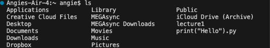
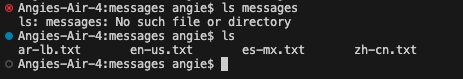
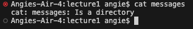
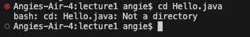
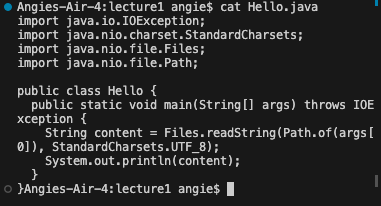

# Part One: command with no arguments.

---
lol
This is what 'cd' does with no arguments. 
The directory was changed from the child to the parent directory, in this case, we go from 'Lecture1' to the home directory. Then if we do 'cd' once again while in the home directory, nothing changes because there is no parent directory. 
There is no error currently. 

This is what 'ls' does with no arguments. 
The command lists all of the files in the home directory of my laptop, which is '/Users/angie'.
This is not an error. 

This is what 'cat' does with no arguments.
It doesn't do anything because there were no arguments meaning there are no contents to print.
There was an error because there was nothing to concatenate. 

# Part Two: command with a path to a directory as an argument.

This is what 'cd' does with a directory as an argument.
The directory changes from 'Lecture1' to 'Messages'. 
There were no errors. 

This is what 'ls' does with a directory as an argument. 
Since we are already in the 'messages' directory, trying to list the contents of the directory we are already in will give us an error. 
If we try the ls command with no arguments, the contents of the directory we are currently in (messages) will be shown.

This is what 'cat' does with a directory as an argument. 
We get an error saying that 'messages' is a directory and therefore cannot be concatenated. Because of this, we can conclude that only files can be concatenated. 

# Part Three: command with a path to a file as an argument.

This is what happens when 'cd' is used with a file as an argument.
There is an error because the file is not a directory and we cannot change our directory to a file.  

This is what happens when 'ls' is used with a file as an argument. 
The output is the file itself being listed since it is not a directory with files inside. 
There is no error. 

This is what happens when 'cat' is used with a file as an argument. 
This is the only way this command works with no errors. The output is the file concatenated and shown as the java code.
The 'cat' command works only with files. 
