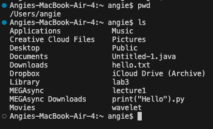

# Part One: command with no arguments.
---

This is what `cd` does with no arguments. 
The directory was changed from the current directory to the home directory. In this case, we go from `Lecture1` to `/Users/angie`. Then, if we do `cd` once again while in the home directory, nothing changes because there is no parent directory. If we try this in another file, like `messages`, we would also go to the home directory, which is `/Users/angie`
There is no error. 

---

This is what `ls` does with no arguments. 
The command lists all of the files in the home directory of my laptop, which is `/Users/angie`. The working directory is the same as the home directory in this example.
This is not an error.

---

This is what `cat` does with no arguments.
It doesn't do anything because there were no arguments meaning there are no contents to print. `Cat` with no arguments turns the terminal into an interactive workspace where you can type lines of text. The working directory is still  `/Users/angie`.
There was no error. 

# Part Two: command with a path to a directory as an argument.
---

This is what `cd` does with a directory as an argument.
The directory changes from the home directory (`/Users/angie`) to `Lecture1`. 
There were no errors. 

---

---
This is what `ls` does with a directory as an argument. 
We are currently in the `Lecture1` directory. When we do `ls` with a directory as an argument (`ls messages`) it lists the contents of the `messages` directory. There are no errors.

---

This is what `cat` does with a directory as an argument. 
We get an error saying that `messages` is a directory and therefore cannot be concatenated. Because of this, we can conclude that only files can be concatenated. This results in an error.

# Part Three: command with a path to a file as an argument.

---

This is what happens when `cd` is used with a file as an argument.
The `cd` command is used to change from the working directory to a different directory. There is an error because `cd` expects a directory path, not a file. 

---

This is what happens when `ls` is used with a file as an argument. 
The output is the file itself being listed since it is not a directory with files inside. 
There is no error. 

---

This is what happens when `cat` is used with a file as an argument. 
This is the only way this command works with no errors. The output is the file concatenated and shown as the java code.
The `cat` command works only with files. 
