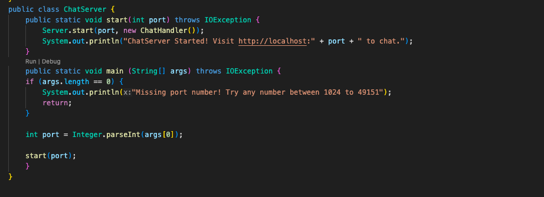
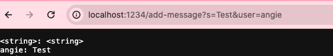
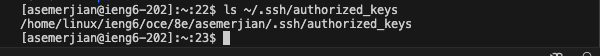

# Part 1 #

---

This is my code for `ChatServer.java` which is in the `wavlet` directory.

---
Screenshot 1: /add-message?s=Test&user=angie

---
1. The main methods that are being called are `main(String[] args)` , `start(int port)` , `Server.start(int port, URLHandler handler)` , `Server.start` , and `handleRequest(URI url)`
2. The `main(String[] args)` method in the `ChatServer` class checks for a provided port number as a command-line argument. If found, it starts the chat server using `start(int port)`, otherwise, it prompts for the missing port number and exits. Within `start(int port)`, the server initializes using `Server.start(int port, URLHandler handler)`, then notifies users of the server's status and access URL. Incoming requests with `/add-message?s=test&user=angie` are handled by the `handleRequest(URI url)` method in `ChatHandler`. Extracting parameters, it constructs a new chat message, appends it to the chat history, and returns the updated history.

---
Screenshot 2: /add-message?s=today%20is%20beautiful&user=talia

---
1. The main methods that are being called are `main(String[] args)` , `start(int port)` , `Server.start(int port, URLHandler handler)` , `Server.start` , and `handleRequest(URI url)`
2. When a user accesses the URL `/add-message?s=today%20is%20beautiful&user=talia`, the main method in the `ChatServer` class checks for a provided port number as a command-line argument. If the port number is present, it initializes the chat server using the `start` method, which in turn sets up the server and prints a message indicating its start and access URL. Upon receiving the request, the `handleRequest` method in the `ChatHandler` class parses the URL, extracts the message and user parameters, constructs a new chat message, and appends it to the chat history. Finally, the updated chat history is returned as a response to the user's request. This process allows users to add messages to the chat by accessing the specified URL with appropriate parameters.

# Part 2 #
---
Logging in without password

---
Public key:

Private key:

# Part 3 #
I've learned how to download files using git clone and curl. I've also learned how to log into the ieng6 browser using my personal laptop. The terminal commands are very useful and I didn't know any of them before this class. I've learned so much about bash and the terminal. 

