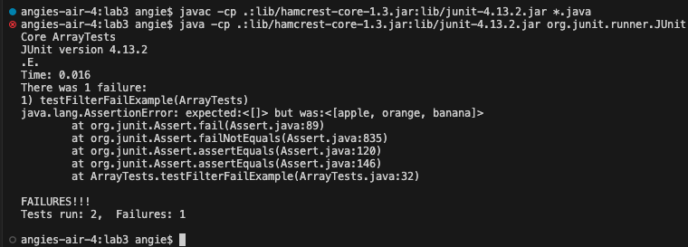
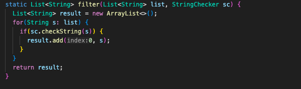
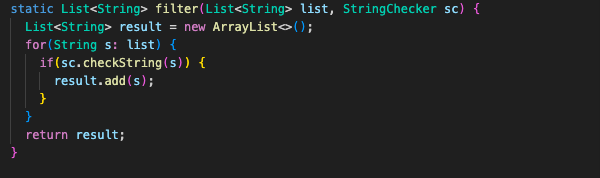
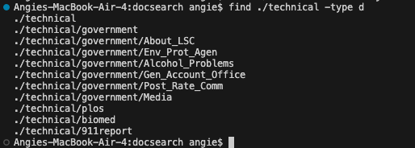
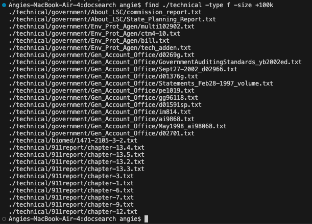
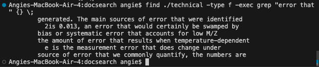

# Part 1 #
1.A failure-inducing input for the buggy program, as a JUnit test and any associated code (write it as a code block in Markdown).

 ```
 @Test
public void testFilterFailExample() {
  List<String> inputList = new ArrayList<>();
  inputList.add("apple");
  inputList.add("orange");
  inputList.add("banana");
  
  StringChecker alwaysTrueChecker = s -> true;
  
  List<String> filteredList = ListExamples.filter(inputList, alwaysTrueChecker);
  
  assertEquals(new ArrayList<>(), filteredList);
}
```
2.An input that doesn't induce a failure, as a JUnit test and any associated code (write it as a code block in Markdown).
```
@Test
  public void testFilterPass() {
    List<String> inputList = new ArrayList<>();
    inputList.add("apple");
    inputList.add("orange");
    inputList.add("banana");`
    
    StringChecker alwaysFalseChecker = s -> false;
    
    List<String> filteredList = ListExamples.filter(inputList, alwaysFalseChecker);
    
    assertTrue(filteredList.isEmpty());
  }
}
```
3.The symptom, as the output of running the two tests above (provide it as a screenshot -- one test should pass, one test should fail).


The output of just the two new tests:


4.The code before:
   

   The code after:
   

5.Briefly describe (2-3 sentences) why the fix addresses the issue.

The issue was that in the `filter` method, the elements were not being added correctly. They were being added to the end and the beginning, making the ist reversed. Erasing the `0` from the index ensures that the element is only added to the end of the list, making the code correct. 

# Part 2 #

I will be using the `find` command. 

1.Using `-name` to search for files or directories with a specific name:

   ```
   find ./technical -name "example.txt"
    find ./technical -name "*.java"
```
 
   The first command finds the file that is called `"example.java"` specifically, while the second command finds every file that is a `.java` file. There are no `.java` files in the `/technical` directory, so the output is empty. 

   ---
   
   ---
   
2.Using `-type` to search for specific types of files:
 
   ```
   find ./technical -type f
   find ./technical -type d
```
 
 The first command searches for regular files within the `./technical` directory. It's useful when you want to list all files without including directories. The second command searches for directories within the `./technical` directory. It's helpful when you want to list only directories without including files.
This is a screenshot of the output of ` find ./technical -type d`

---

---
   
3.Using `-size` to search for files of a specific size:
   
   ```
   find ./technical -type f -size +100K
   find ./technical -type f -size -10k
```

 
The first command searches for files larger than 100 kilobytes within the `./technical` directory. It's useful when you need to find large files that may be taking up significant disk space. The second command searches for files smaller than 10 kilobytes within the `./technical` directory. It's helpful for finding small files that may be insignificant or can be safely deleted.
This is the output of the `find ./technical -type f -size +100K` command. 

---

---

4.Using `-exec` to perform an action on each file found:
   
   ```
   find ./technical -type f -exec ls -l {} \;
   find ./technical -type f -exec grep "search_term" {} \;
```
   

  The first command executes the `ls -l` command on each regular file found within the `./technical` directory, displaying detailed information for each file. It's useful for performing actions, such as listing detailed information or performing operations, on each file found. The second command searches for a specific term within each regular file found within the `./technical` directory using the grep command. It's helpful for searching for specific content within multiple files.
This is the output of the `find ./technical -type f -exec grep "error that" {} \;` command. It shows all of the text that has the specific search term, which in this case is "error that"

---

---


# Sources #
The following website was used for the explanations of the `find` commands. 
`https://math2001.github.io/article/bashs-find-command/` This source had lots of information on how to use the find command, including all of the commands that the find command can work with. (`-not, -or ,-and, etc. `) This is where I found most of the information used for this lab report. The rest was information that I already knew and/or learned in lecture. 

