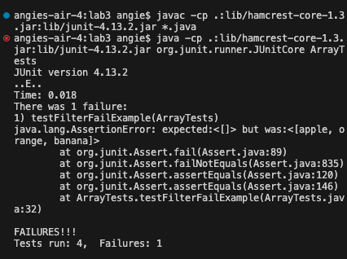

# Part 1 #
1.A failure-inducing input for the buggy program, as a JUnit test and any associated code (write it as a code block in Markdown).
 
 `@Test
public void testFilterFailExample() {
  List<String> inputList = new ArrayList<>();
  inputList.add("apple");
  inputList.add("orange");
  inputList.add("banana");
  `
 `StringChecker alwaysTrueChecker = s -> true;`
  
 ` List<String> filteredList = ListExamples.filter(inputList, alwaysTrueChecker);`
  
`  assertEquals(new ArrayList<>(), filteredList);
}`

2.An input that doesn't induce a failure, as a JUnit test and any associated code (write it as a code block in Markdown).

`@Test
  public void testFilterPass() {
    List<String> inputList = new ArrayList<>();
    inputList.add("apple");
    inputList.add("orange");
    inputList.add("banana");`
    
    StringChecker alwaysFalseChecker = s -> false;
    
    List<String> filteredList = ListExamples.filter(inputList, alwaysFalseChecker);
    
    assertTrue(filteredList.isEmpty());
  `}
}
`

3. The symptom, as the output of running the two tests above (provide it as a screenshot -- one test should pass, one test should fail).

# Part 2 #

I will be using the `find` command. 

1. Using -name to search for files or directories with a specific name:

   ---

   `find ./technical -name "example.txt"`
   
   ---
 
   This command finds the file that is called `"example.java"`
   
   ---
   
   `find ./technical -name "*.java"`
   
    ---
   
   this command finds every file that is a .java file.
   
    ---
   
3. Using -type to search for specific types of files:
   
   ---
   
   `find ./technical -type f`

   ---
   
   This command searches for regular files within the ./technical directory. It's useful when you want to list all files without including
   directories.

   ---
   
   `find ./technical -type d`

   ---
   
   This command searches for directories within the ./technical directory. It's helpful when you want to list only directories without including files.

    ---

5. Using -size to search for files of a specific size:

   ---
   
   `find ./technical -type f -size +1M`

   ---
   
   This command searches for files larger than 1 megabyte within the ./technical directory. It's useful when you need to find large files that may be taking up significant disk space.

   ---
   
   `find ./technical -type f -size -10k`

   ---
   
   This command searches for files smaller than 10 kilobytes within the ./technical directory. It's helpful for finding small files that may be insignificant or can be safely deleted.

   ---

7. Using -exec to perform an action on each file found:

   ---
   
   `find ./technical -type f -exec ls -l {} \;`

   ---
   
   his command executes the ls -l command on each regular file found within the ./technical directory, displaying detailed information for each file. It's useful for performing actions, such as listing detailed information or performing operations, on each file found.

   ---
   
   `find ./technical -type f -exec grep "search_term" {} \;`

   ---
   
   This command searches for a specific term within each regular file found within the ./technical directory using the grep command. It's helpful for searching for specific content within multiple files.

