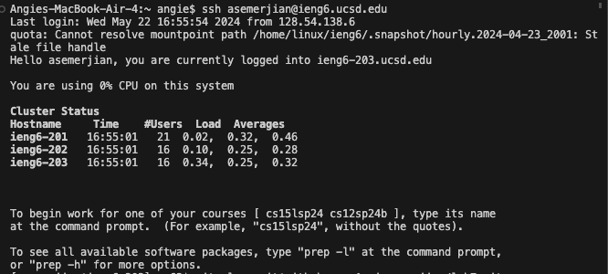
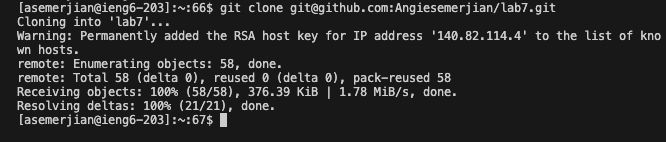
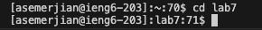
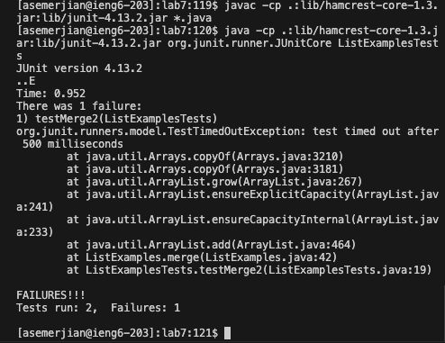
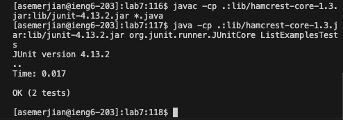
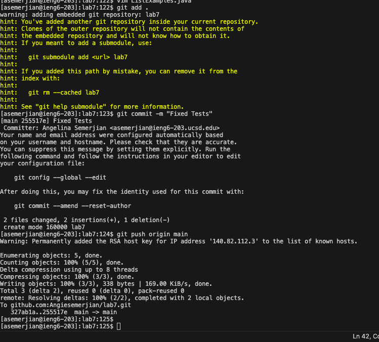

# Step 4 #
```
ssh <space> asemerjian@ieng6.ucsd.edu
<enter>
```

# Step 5 #
```
<Command-C>
git <space> clone <space> <Command-V> git@github.com:Angiesemerjian/lab7.git`
<enter>
cd <space> lab7
<enter>
```



This command clones the repository into our workspace. It makes it so all of the files and directories are in our workspace and able to be worked on. 

# Step 6 # 

```
<up>, <enter>
```
The `javac -cp .:lib/hamcrest-core-1.3.jar:lib/junit-4.13.2.jar *.java` command was one up in the history. 

```
command-C, command-V, <enter>
```
The `java -cp .:lib/hamcrest-core-1.3.jar:lib/junit-4.13.2.jar org.junit.runner.JUnitCore ListExamplesTests` was copied and pasted. The commands are Command-C to copy and Command-V to paste. These commands compile and run the files to show what their outputs will be, whether its a test that fails or succeeds, or a command in the java file. 



# Step 7 # 

command:
`vim <space> ListExamples.java`
```
<down> x50
i
delete, 2
esc
Shift :wq, <enter>
```


When you enter vim, you must use the down arrow to go to line 50, where index1+=1 is located. Then you must delete the 1 and change it to a 2, then save and exit. This changes the name of the iteration. We have two commands called Index1 that do different things, we must change them to have different names so the code runs with no syntax errors. 

# Step 8 #

```
<up>,<up>, <enter>,<up>, <up>, <enter>
```
The command `javac -cp .:lib/hamcrest-core-1.3.jar:lib/junit-4.13.2.jar *.java` was two up in the history. After compiling the files, I used the command `java -cp .:lib/hamcrest-core-1.3.jar:lib/junit-4.13.2.jar org.junit.runner.JUnitCore ListExamplesTests`, which was also two up in the history. 

These commands compile and run the java files. There are no more errors since we changed the syntax in the code. 


# Step 9 #
```
git <space> add . <enter>
git <space> commit <space> -m <space> "Fixed <space> Tests" <enter>
git <space> push <space> origin <space> main <enter>
```


These commands add the changes to a git repository, commit them with a message, and push the changes into a remote repository. 
