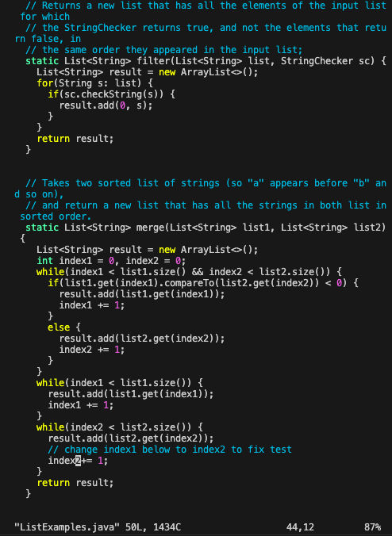

# Step 4 #
```
ssh asemerjian@ieng6.ucsd.edu
<enter>
```

# Step 5 #
```
git clone  git@github.com:Angiesemerjian/lab7.git`
<enter>
cd lab7
<enter>
```


# Step 6 # 

```
<up>, <enter>
```
The `javac -cp .:lib/hamcrest-core-1.3.jar:lib/junit-4.13.2.jar *.java` command was one up in the history. 

```
command-V, <enter>
```
The `java -cp .:lib/hamcrest-core-1.3.jar:lib/junit-4.13.2.jar org.junit.runner.JUnitCore ListExamplesTests` was copied and pasted. 


# Step 7 # 

command:
`vim ListExamples.java`
```
i
delete, 2
esc
Shift :wq, <enter>
```


# Step 8 #

```
<up>,<up>, <enter>,<up>, <up>, <enter>
```
The command `javac -cp .:lib/hamcrest-core-1.3.jar:lib/junit-4.13.2.jar *.java` was two up in the history. After compiling the files, I used the command `java -cp .:lib/hamcrest-core-1.3.jar:lib/junit-4.13.2.jar org.junit.runner.JUnitCore ListExamplesTests`, which was also two up in the history. 


# Step 9 #
```
git add . <enter>
git commit -m "Fixed Tests" <enter>
git push origin main <enter>
```


